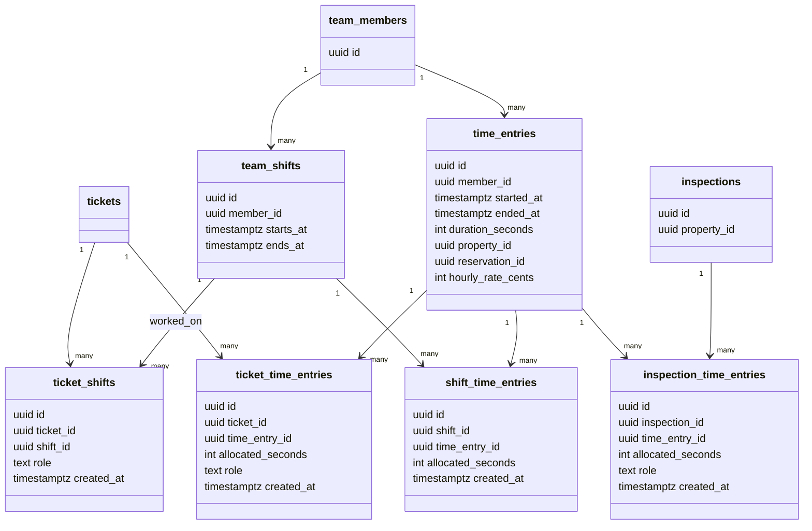
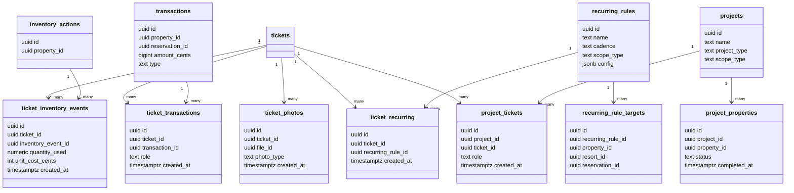
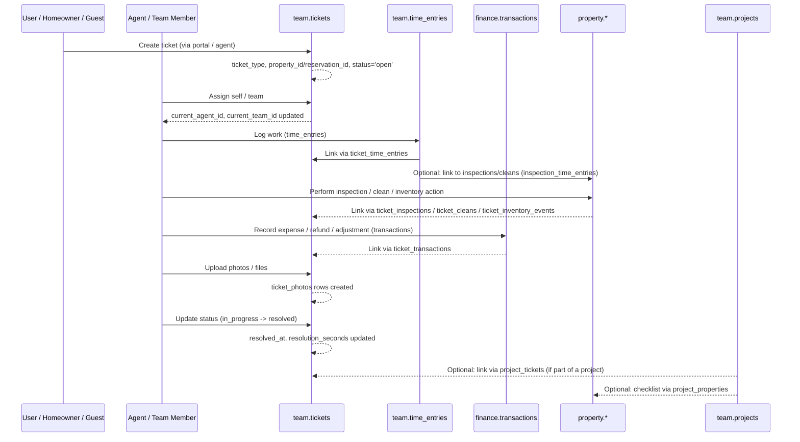

# Central Memory – Ticketing System Documentation

This document explains the **unified ticketing system** design, with:

- Visuals (Mermaid diagrams) showing how tickets connect to people, time, properties, inspections, inventory, money, projects, etc.
- A **table breakdown** listing every table involved in the ticket flow, with purpose + key PK/FKs.

---

## 1. High-Level Ticketing Overview (Visual)

```mermaid
flowchart LR
    subgraph Team["team schema"]
        T[tickets]
        TP[ticket_participants]
        TProp[ticket_properties]
        THm[ticket_homeowners]
        TVend[ticket_vendors]
        TS[ticket_shifts]
        TTEntry[ticket_time_entries]
        TInv[ticket_inventory_events]
        TTxn[ticket_transactions]
        TPhoto[ticket_photos]
        TRec[ticket_recurring]
        TProjT[project_tickets]
        TEmp[team_members]
        TShift[team_shifts]
        TTime[time_entries]
        Proj[projects]
        ProjProp[project_properties]
        RecRule[recurring_rules]
        RecTarget[recurring_rule_targets]
    end

    subgraph Property["property schema"]
        Prop[properties]
        Insp[inspections]
        Clean[cleans]
        InvAct[inventory_actions]
        InspTime[inspection_time_entries]
    end

    subgraph Reservations["reservations schema"]
        Res[reservations]
    end

    subgraph Finance["finance schema"]
        Txn[transactions]
    end

    subgraph Directory["directory schema"]
        Contact[contacts]
        Company[companies]
    end

    %% Core links
    T --> TP
    T --> TProp
    T --> THm
    T --> TVend
    T --> TS
    T --> TTEntry
    T --> TInv
    T --> TTxn
    T --> TPhoto
    T --> TRec
    T --> TProjT

    TEmp --> TShift
    TEmp --> TTime
    TShift --> TS
    TTime --> TTEntry
    TTime --> InspTime

    TProp --> Prop
    THm --> Contact
    TVend --> Company

    TP --> Contact

    TTxn --> Txn
    TInv --> InvAct

    T -->|property_id| Prop
    T -->|reservation_id| Res
    T -->|homeowner_id| Contact
    Txn --> Prop
    Txn --> Res

    InspTime --> Insp
    T --> TS
    T --> TTEntry
    T --> TInv
    T --> TTxn
    T --> TPhoto

    RecRule --> RecTarget
    RecTarget --> Prop
    RecTarget --> Res
    TRec --> RecRule

    Proj --> ProjProp
    Proj --> TProjT
    ProjProp --> Prop
````

---

## 2. Core Ticket Structure & Relationships

### 2.1 Core Ticket & Participants

```mermaid
classDiagram
    class tickets {
        uuid id
        text ticket_type
        text title
        text status
        text priority
        text source
        uuid property_id
        uuid reservation_id
        uuid homeowner_id
        uuid requestor_contact_id
        uuid current_agent_id
        uuid current_team_id
        timestamptz created_at
        timestamptz first_response_at
        timestamptz resolved_at
        int active_time_seconds
        int resolution_seconds
        text description
        text notes
    }

    class ticket_participants {
        uuid id
        uuid ticket_id
        uuid contact_id
        text role
        bool notify
        timestamptz created_at
    }

    class ticket_properties {
        uuid id
        uuid ticket_id
        uuid property_id
        text role
        timestamptz created_at
    }

    class ticket_homeowners {
        uuid id
        uuid ticket_id
        uuid homeowner_id
        text role
        timestamptz created_at
    }

    class ticket_vendors {
        uuid id
        uuid ticket_id
        uuid vendor_id
        text role
        timestamptz created_at
    }

    class team_members {
        uuid id
        uuid contact_id
        uuid team_id
        uuid manager_id
    }

    class properties {
        uuid id
    }
    class reservations {
        uuid id
    }
    class contacts {
        uuid id
    }
    class companies {
        uuid id
    }

    tickets "1" --> "many" ticket_participants : participants
    tickets "1" --> "many" ticket_properties : extra properties
    tickets "1" --> "many" ticket_homeowners : extra homeowners
    tickets "1" --> "many" ticket_vendors : extra vendors

    tickets --> properties : property_id
    tickets --> reservations : reservation_id
    tickets --> contacts : homeowner_id
    tickets --> contacts : requestor_contact_id
    tickets --> team_members : current_agent_id

    ticket_participants --> contacts : contact_id
    ticket_properties --> properties : property_id
    ticket_homeowners --> contacts : homeowner_id
    ticket_vendors --> companies : vendor_id
```

---

### 2.2 Time, Shifts, Inspections & Cleans



---

### 2.3 Inventory, Finance, Photos, Recurring, Projects



---

## 3. Ticket Lifecycle Flow (Narrative Visual)



---

## 4. Table Breakdown (Markdown Tables)

Below is a breakdown of **all tables in the ticket flow**, grouped by area.

### 4.1 Core Ticket & Participants

| Schema | Table                 | Type | Purpose                                                       | Key Columns (PK / FKs)                                                                                                                                                                                                                                                                           |
| ------ | --------------------- | ---- | ------------------------------------------------------------- | ------------------------------------------------------------------------------------------------------------------------------------------------------------------------------------------------------------------------------------------------------------------------------------------------ |
| `team` | `tickets`             | core | Single source of truth for all tickets (all types)            | **PK**: `id` • **FKs**: `property_id → property.properties(id)` • `reservation_id → reservations.reservations(id)` • `homeowner_id → directory.contacts(id)` • `requestor_contact_id → directory.contacts(id)` • `current_agent_id → team.team_members(id)` • `current_team_id → team.teams(id)` |
| `team` | `ticket_participants` | join | Who participates in a ticket (owners, guests, vendors, CCs)   | **PK**: `id` • **FKs**: `ticket_id → team.tickets(id)` • `contact_id → directory.contacts(id)`                                                                                                                                                                                                   |
| `team` | `ticket_properties`   | join | Extra properties related to a ticket (multi-property context) | **PK**: `id` • **FKs**: `ticket_id → team.tickets(id)` • `property_id → property.properties(id)`                                                                                                                                                                                                 |
| `team` | `ticket_homeowners`   | join | Extra homeowners related to a ticket                          | **PK**: `id` • **FKs**: `ticket_id → team.tickets(id)` • `homeowner_id → directory.contacts(id)`                                                                                                                                                                                                 |
| `team` | `ticket_vendors`      | join | Vendors involved in a ticket (quotes, work, supplies)         | **PK**: `id` • **FKs**: `ticket_id → team.tickets(id)` • `vendor_id → directory.companies(id)`                                                                                                                                                                                                   |

---

### 4.2 Team / Shifts / Members

| Schema | Table           | Type | Purpose                                               | Key Columns (PK / FKs)                                                                                                            |
| ------ | --------------- | ---- | ----------------------------------------------------- | --------------------------------------------------------------------------------------------------------------------------------- |
| `team` | `teams`         | core | Logical teams (property care, reservations, finance…) | **PK**: `id`                                                                                                                      |
| `team` | `team_members`  | core | Employee/team member directory                        | **PK**: `id` • **FKs**: `contact_id → directory.contacts(id)` • `team_id → team.teams(id)` • `manager_id → team.team_members(id)` |
| `team` | `team_shifts`   | core | Individual shifts for team members                    | **PK**: `id` • **FKs**: `member_id → team.team_members(id)`                                                                       |
| `team` | `ticket_shifts` | join | Which shifts were associated with which tickets       | **PK**: `id` • **FKs**: `ticket_id → team.tickets(id)` • `shift_id → team.team_shifts(id)`                                        |

---

### 4.3 Time Tracking

| Schema     | Table                     | Type | Purpose                                                               | Key Columns (PK / FKs)                                                                                                                                                         |
| ---------- | ------------------------- | ---- | --------------------------------------------------------------------- | ------------------------------------------------------------------------------------------------------------------------------------------------------------------------------ |
| `team`     | `time_entries`            | core | Atomic chunks of work time by a member                                | **PK**: `id` • **FKs**: `member_id → team.team_members(id)` • `property_id → property.properties(id)` (nullable) • `reservation_id → reservations.reservations(id)` (nullable) |
| `team`     | `ticket_time_entries`     | join | Allocate time entries to specific tickets                             | **PK**: `id` • **FKs**: `ticket_id → team.tickets(id)` • `time_entry_id → team.time_entries(id)`                                                                               |
| `team`     | `shift_time_entries`      | join | Link time entries to shifts (how time fits into schedule)             | **PK**: `id` • **FKs**: `shift_id → team.team_shifts(id)` • `time_entry_id → team.time_entries(id)`                                                                            |
| `property` | `inspection_time_entries` | join | Link time entries to inspections (how much time each inspection used) | **PK**: `id` • **FKs**: `inspection_id → property.inspections(id)` • `time_entry_id → team.time_entries(id)`                                                                   |

---

### 4.4 Property / Inspections / Cleans / Inventory (Joins)

| Schema         | Table               | Type   | Purpose                                                  | Key Columns (PK / FKs)                                                                                                        |
| -------------- | ------------------- | ------ | -------------------------------------------------------- | ----------------------------------------------------------------------------------------------------------------------------- |
| `property`     | `properties`        | domain | Property master (outside ticket system, used as context) | **PK**: `id`                                                                                                                  |
| `reservations` | `reservations`      | domain | Reservation master (used as context)                     | **PK**: `id`                                                                                                                  |
| `property`     | `inspections`       | domain | Inspections of properties                                | **PK**: `id` • **FKs**: `property_id → property.properties(id)`                                                               |
| `property`     | `cleans`            | domain | Cleans/turns at properties                               | **PK**: `id` • **FKs**: `property_id → property.properties(id)` • `reservation_id → reservations.reservations(id)` (nullable) |
| `property`     | `inventory_actions` | domain | Actual inventory events (add/remove/use)                 | **PK**: `id` • **FKs**: `property_id → property.properties(id)`                                                               |

| Schema | Table                     | Type | Purpose                                                                    | Key Columns (PK / FKs)                                                                                         |
| ------ | ------------------------- | ---- | -------------------------------------------------------------------------- | -------------------------------------------------------------------------------------------------------------- |
| `team` | `ticket_inspections`      | join | Link tickets to inspections                                                | **PK**: `id` • **FKs**: `ticket_id → team.tickets(id)` • `inspection_id → property.inspections(id)`            |
| `team` | `ticket_cleans`           | join | Link tickets to cleans                                                     | **PK**: `id` • **FKs**: `ticket_id → team.tickets(id)` • `clean_id → property.cleans(id)`                      |
| `team` | `ticket_inventory_events` | join | Link tickets to inventory actions (what inventory a ticket used/triggered) | **PK**: `id` • **FKs**: `ticket_id → team.tickets(id)` • `inventory_event_id → property.inventory_actions(id)` |

---

### 4.5 Finance / Transactions / Purchases

| Schema    | Table                 | Type   | Purpose                                                 | Key Columns (PK / FKs)                                                                                             |
| --------- | --------------------- | ------ | ------------------------------------------------------- | ------------------------------------------------------------------------------------------------------------------ |
| `finance` | `transactions`        | domain | Money movements: expenses, owner payouts, refunds, etc. | **PK**: `id` • **FKs**: `property_id → property.properties(id)` • `reservation_id → reservations.reservations(id)` |
| `team`    | `ticket_transactions` | join   | Which transactions are associated with which tickets    | **PK**: `id` • **FKs**: `ticket_id → team.tickets(id)` • `transaction_id → finance.transactions(id)`               |

---

### 4.6 Photos / Documents

| Schema | Table           | Type | Purpose                               | Key Columns (PK / FKs)                                                                      |
| ------ | --------------- | ---- | ------------------------------------- | ------------------------------------------------------------------------------------------- |
| `team` | `ticket_photos` | join | Link tickets to uploaded files/photos | **PK**: `id` • **FKs**: `ticket_id → team.tickets(id)` • `file_id → <file_store_table>(id)` |

*(The file storage table might live in another schema, e.g. `files.files` or `observability.files`.)*

---

### 4.7 Recurring Tickets

| Schema | Table                    | Type | Purpose                                                           | Key Columns (PK / FKs)                                                                                                                                                                                                             |
| ------ | ------------------------ | ---- | ----------------------------------------------------------------- | ---------------------------------------------------------------------------------------------------------------------------------------------------------------------------------------------------------------------------------- |
| `team` | `recurring_rules`        | core | Definition of recurring rules (cadence + scope)                   | **PK**: `id`                                                                                                                                                                                                                       |
| `team` | `recurring_rule_targets` | core | Which properties/reservations/resorts a recurring rule applies to | **PK**: `id` • **FKs**: `recurring_rule_id → team.recurring_rules(id)` • `property_id → property.properties(id)` (nullable) • `resort_id → geo.areas(id)` (nullable) • `reservation_id → reservations.reservations(id)` (nullable) |
| `team` | `ticket_recurring`       | join | Which tickets were generated from which recurring rule            | **PK**: `id` • **FKs**: `ticket_id → team.tickets(id)` • `recurring_rule_id → team.recurring_rules(id)`                                                                                                                            |

---

### 4.8 Projects & Per-Property Checklists

| Schema | Table                | Type | Purpose                                             | Key Columns (PK / FKs)                                                                                                                      |
| ------ | -------------------- | ---- | --------------------------------------------------- | ------------------------------------------------------------------------------------------------------------------------------------------- |
| `team` | `projects`           | core | High-level projects (“do X across many properties”) | **PK**: `id` • **FKs**: `created_by_member_id → team.team_members(id)`                                                                      |
| `team` | `project_properties` | core | Per-property checklist rows for a project           | **PK**: `id` • **FKs**: `project_id → team.projects(id)` • `property_id → property.properties(id)` • `resort_id → geo.areas(id)` (optional) |
| `team` | `project_tickets`    | join | Which tickets belong to which project               | **PK**: `id` • **FKs**: `project_id → team.projects(id)` • `ticket_id → team.tickets(id)`                                                   |

---